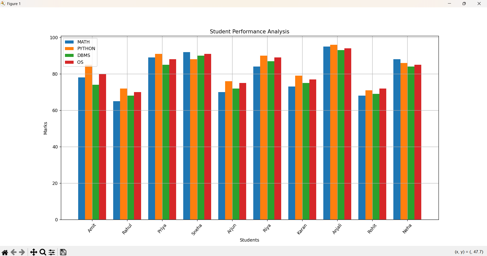
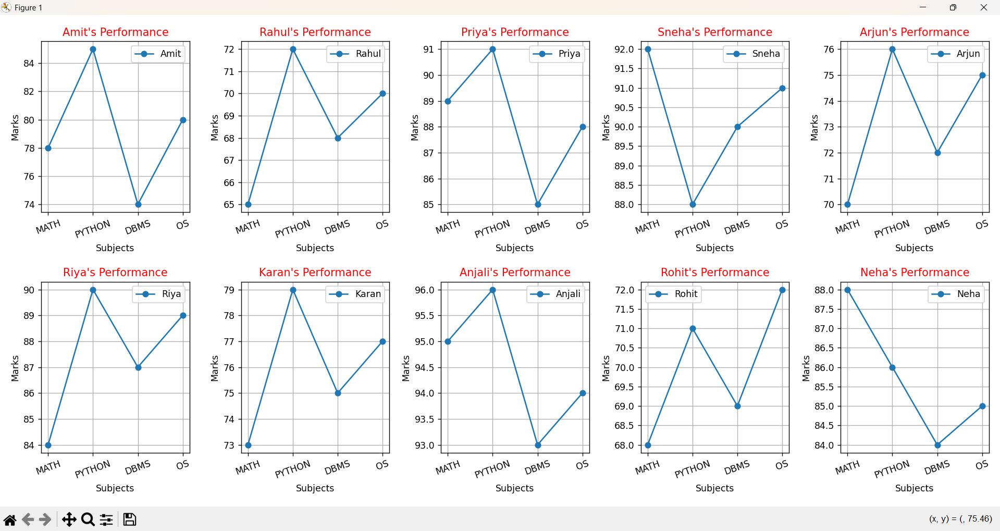
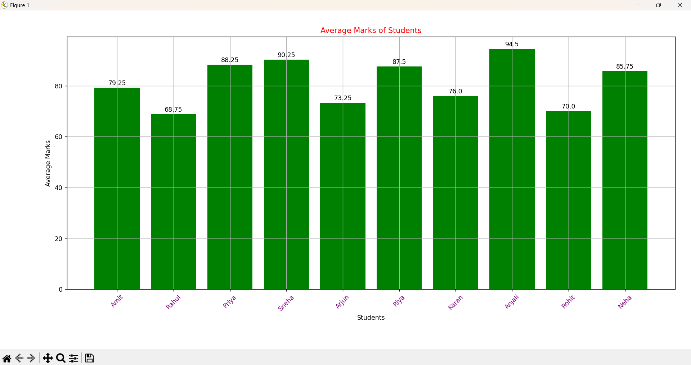
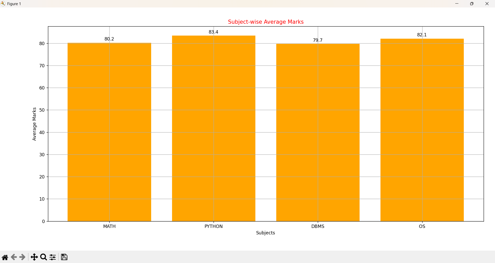

Student Performance Analysis

A beginner-level Python project that analyzes student marks using NumPy and visualizes the results using Matplotlib.

## Technologies Used

* Python
* NumPy
* Matplotlib

## Dataset

The project contains marks of 10 students in 4 subjects:

* Math
* Python
* DBMS
* OS

## Features

* Overall subject-wise student performance
* Individual student performance analysis
* Student average marks
* Highest and lowest performing student
* Subject-wise average marks
* Best and lowest performing subject
* Bar charts and line charts
* Average values displayed on charts

## Images

## Visualizations









## How to Run

Install the required libraries:

```bash
pip install numpy matplotlib

